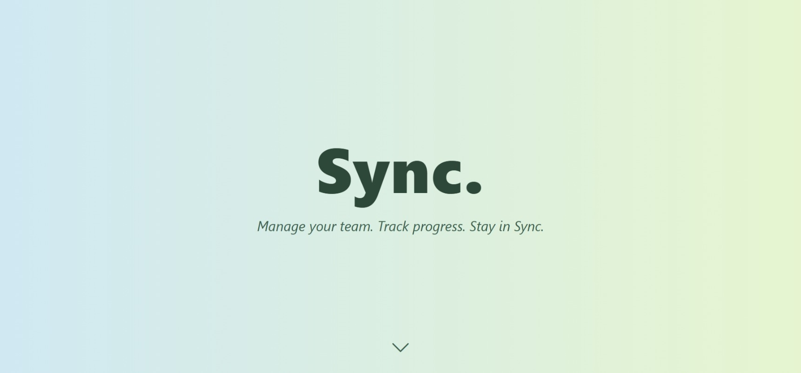
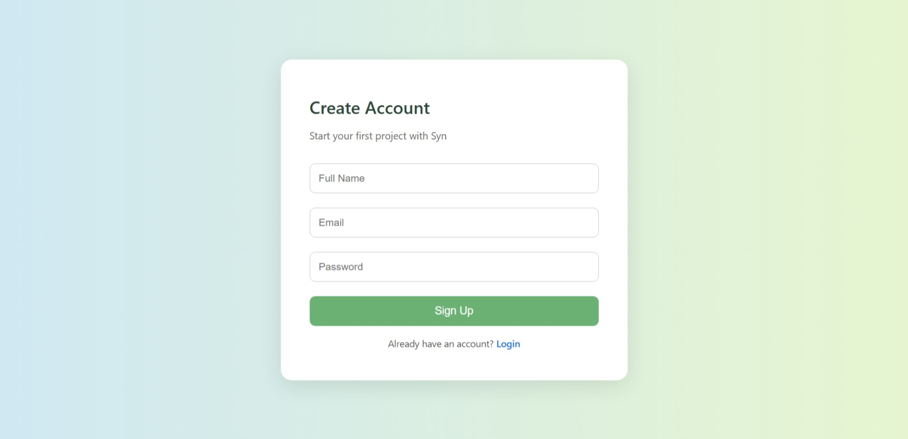
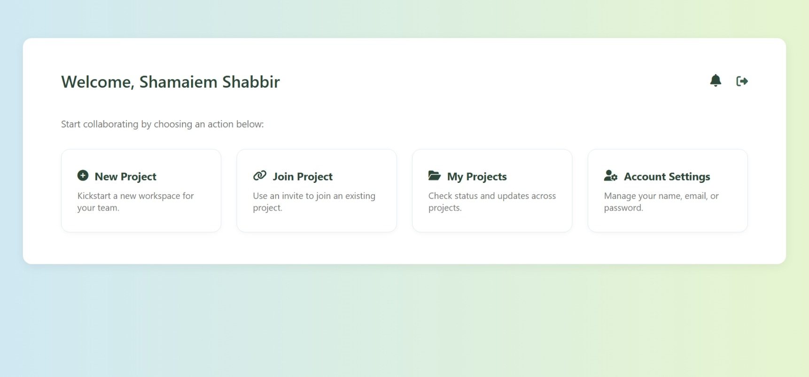
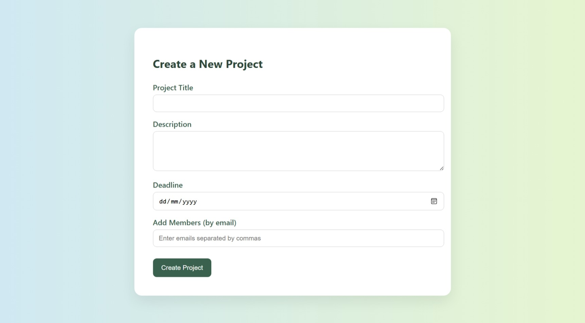
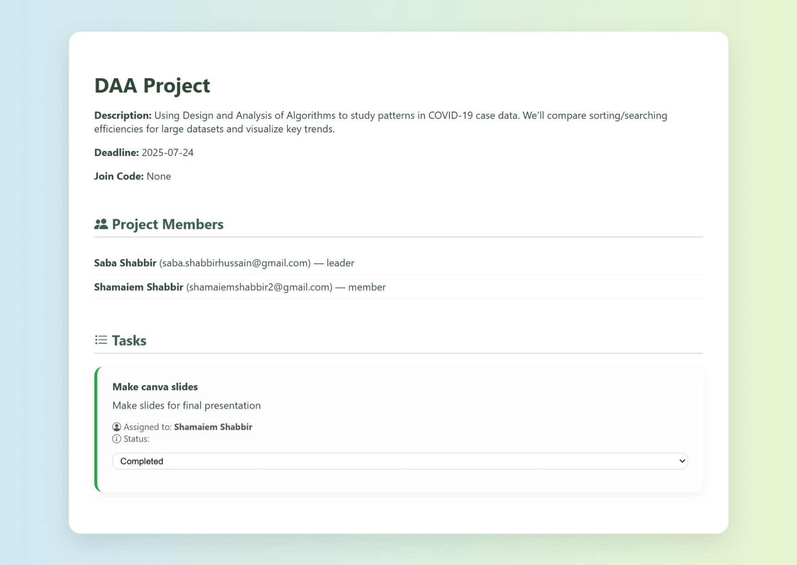
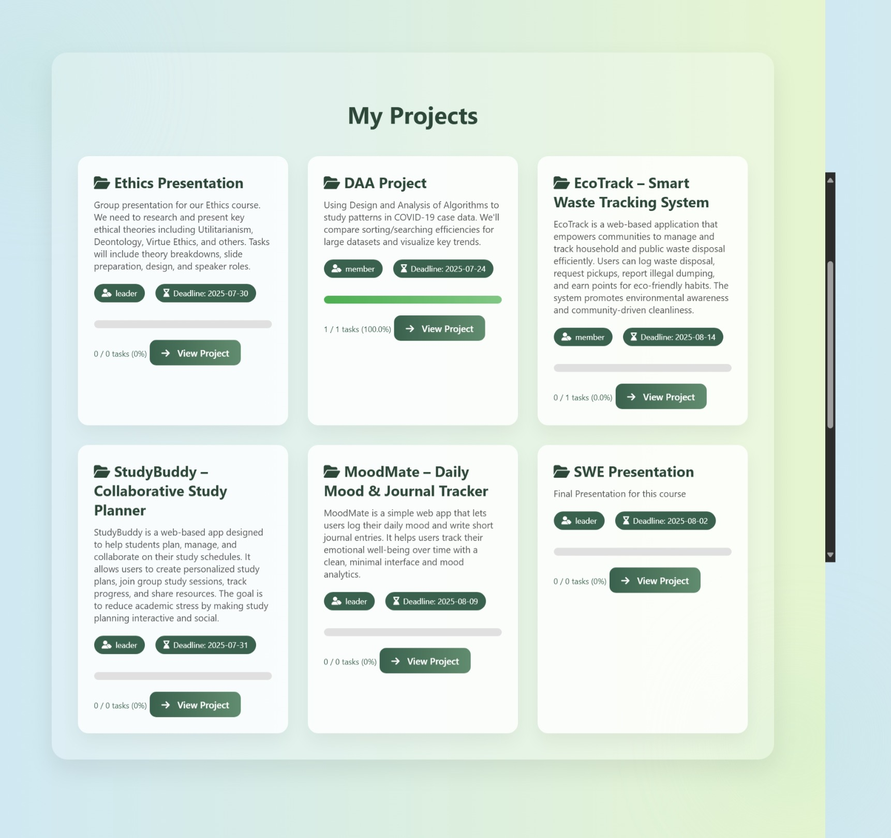
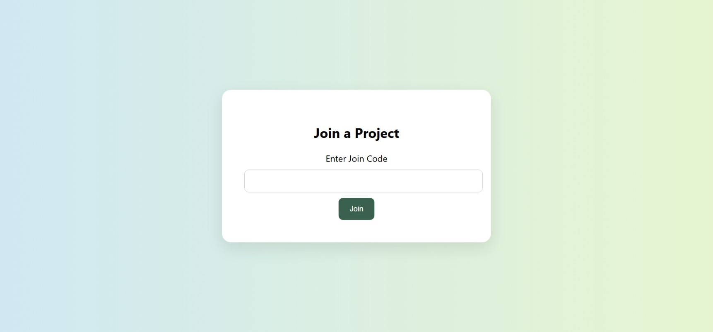
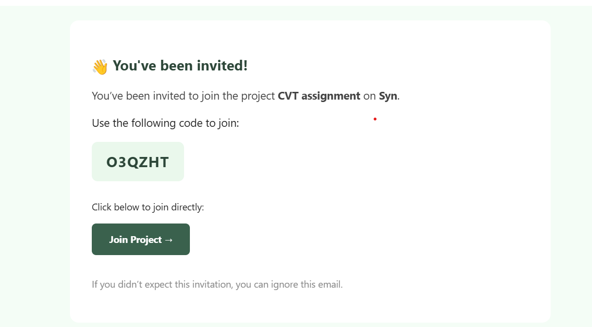
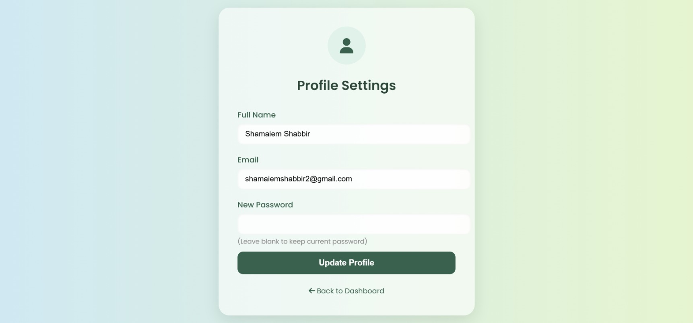

# 🔗 Sync – Project Manager for University Students

<p align="center">
  
</p>

---

💬 *Tired of juggling multiple WhatsApp groups for assignments, projects, and deadlines?*  

*Sync* is a *lightweight, intuitive project and task management web app* designed especially for *university students and small teams*.  

✨ *What you can do with Sync:*  
- 📁 Create and organize projects effortlessly  
- 👥 Add members and manage your team smoothly  
- ✅ Assign tasks and track progress in real time  
- ⚡ Enjoy a clutter-free, simple platform for collaboration  

🚀 *All-in-one, simple, and smooth collaboration — teamwork made fun!*

---


## ✨ Features

- 🔐 *User Authentication* – Secure signup & login system  
- 📁 *Project Management* – Create and manage projects with ease  
- 👥 *Team Members* – Invite and manage group members  
- ✅ *Task Tracking* – Create tasks, assign members, track status  
- 📩 *Email Join Codes* – Invite teammates via unique project codes (coming soon)  
- 🖥 *Clean UI* – Google-style login/signup with a responsive dashboard  

---

## 🛠 Tech Stack

- *Backend*: Python (Flask)  
- *Frontend*: HTML, CSS, JS
- *Database*: SQLite  

---

## ⚡ Getting Started

Follow these steps to run *Sync* locally:

### 1️⃣ Clone the repo
```bash
git clone https://github.com/shamaiem10/sync.git
cd sync
```

### 2️⃣ Create a virtual environment

```bash
python -m venv venv
source venv/bin/activate   # (Linux/Mac)
venv\Scripts\activate      # (Windows)
```

### 3️⃣ Install dependencies

```bash
pip install -r requirements.txt
```
### 4️⃣ Database setup

```bash
python database_setup.py
```
### 5️⃣ Run the app

```bash
python app.py
```

App will be live at 👉 *[http://127.0.0.1:5000/](http://127.0.0.1:5000/)*

---
## 📸 Screenshots

<details>
  <summary>🌿 Landing Page</summary>
    
</details>

<details>
  <summary>🔑 Login & Signup</summary>
    
</details>

<details>
  <summary>📊 Dashboard</summary>
    
</details>

<details>
  <summary>🗂 Task Management</summary>
    
    
</details>

<details>
  <summary>👥 Team Features</summary>
    
    
    
</details>

<details>
  <summary>⚙ Settings</summary>
    
</details>


## 🤝 Contributing

Contributions, issues, and feature requests are welcome!

---

## 📧 Contact

Made with ❤ by *Shamaiem*  
For queries: [shamaiemshabbir14@gmail.com](mailto:shamaiemshabbir14@gmail.com)


### ⭐ If you like this project, don’t forget to star the repo!


